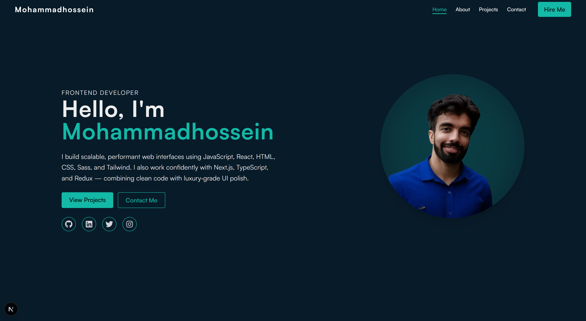

# Mohammadhossein Zamani — Frontend Developer Portfolio

Welcome to my personal portfolio! This site showcases my frontend development work, built with modern technologies and a focus on editorial-grade UI polish.

## 🚀 Live Demo

[Visit the live site](https://velvra-fashion-ecom-git-35d778-mohammadhossein-zamanis-projects.vercel.app)

## 🖼️ Preview

## 🛠️ Tech Stack

- Languages: JavaScript, TypeScript
- Frameworks: React, Next.js
- Styling: HTML, CSS, Sass, Tailwind
- State & Motion: Redux, Framer Motion

## 📁 Project Structure

/components → Reusable UI components
/pages → Route-based pages
/data → Project metadata
/hooks → Custom React hooks
/public → Static assets

## 📸 Featured Projects

Each showcased project highlights:

- Fully responsive, accessible UI
- Clean, semantic HTML structure
- Scalable and maintainable architecture
- Live demo + GitHub repository links

---

## ⚙️ Setup

Clone the repo and install dependencies:

git clone https://github.com/your-username/portfolio.git
cd portfolio
npm install
npm run dev

---

## 📬 Contact

Feel free to reach out for freelance work or collaborations:

Let’s connect: [geniuspeople78@gmail.com](mailto:geniuspeople78@gmail.com)

- LinkedIn: [Mohammadhossein Zamani](https://linkedin.com/in/mohammadhossein-zamani-1965b0237)

---

Crafted with intention by Mohammadhossein Zamani © 2025
